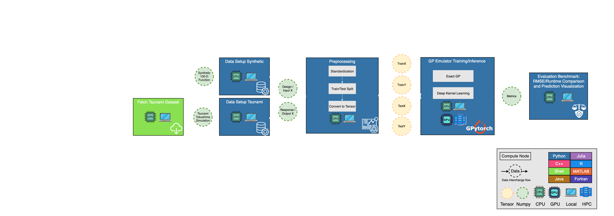
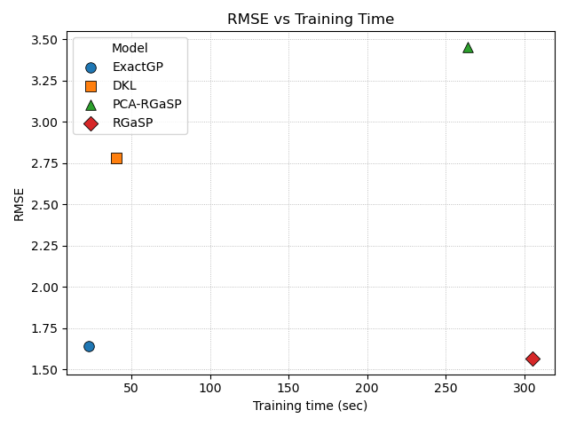
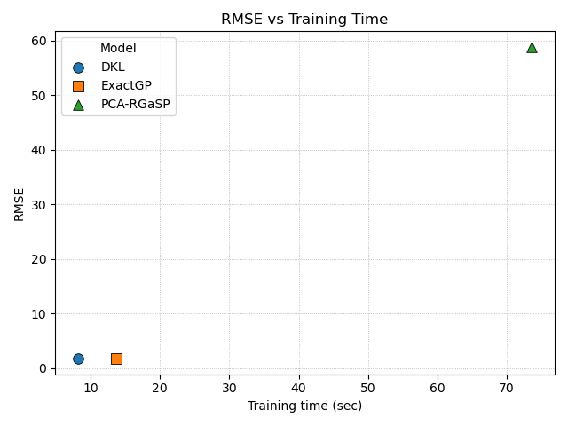

# NextFlow Demo: GPytorch High-dimensional Input Problem (DKL)

A **language-agnostic** modular NextFlow pipeline for benchmarking Gaussian Process models on high-dimensional input problems. Supports Python (GPyTorch) and R (RobustGaSP) implementations with HDF5 data interchange.

## Workflow



The pipeline follows a 4-step workflow:

1. **Data Setup**: Generate synthetic data or fetch and process real-world data using specialized modules
2. **Preprocessing**: Standardize, split, and save data in **HDF5 format** (language-agnostic)
3. **Model Evaluation**: Train and evaluate **three GP models in parallel**:
   - **ExactGP** (Python/GPyTorch)
   - **DKL** (Python/GPyTorch)
   - **RGaSP** (R/RobustGaSP)
   - **PCA-RGaSP** (R/RobustGaSP + PCA)
   
   Note: For larger dataset like Tsunami datasets, only **DKL** and **PCA-RGaSP** are evaluated in local devices since exact inference for **ExactGP** and **RGaSP** may face computational bottleneck.
4. **Benchmark Metrics**: Compare model performance and save results

## Supported Datasets

### Synthetic Dataset

- **Type**: Generated high-dimensional synthetic data
- **Description**: 100D synthetic function for testing purposes
- **Configuration**: Customizable sample size and random seed for reproducibility

### Tsunami Dataset

- **Type**: Real-world data from Zenodo repository
- **Description**: Neural network-based surrogate model for tsunami inundation assessment
- **Source**: [DOI: 10.5281/zenodo.15093228](https://zenodo.org/records/15093228)
- **Data**: Initial water level distributions, tsunami water level distributions, and inundation distributions

## Folder Structure
Currently, there are two branches here: main and per_process_env. 

In main branch: 
```
.
├── nextflow.config          # Main NextFlow configuration
├── environment.yml          # Conda environment specification
├── requirements.txt         # Python dependencies
├── README.md
├── img/
│   └── workflow.png         # Pipeline workflow diagram
├── conf/                    # Configuration files
│   ├── conda.config         # Conda-specific settings
│   ├── datasets.config      # Dataset definitions and parameters
│   └── profiles.config      # Execution profiles (local, HPC, etc.)
├── workflows/
│   └── main.nf              # Main workflow orchestration
├── modules/                 # Modular NextFlow processes
│   ├── fetch_from_zenodo.nf # Data fetching from Zenodo
│   ├── data_setup_synthetic.nf # Synthetic data generation
│   ├── data_setup_tsunami.nf   # Tsunami data processing
│   ├── preprocessing.nf     # Data standardization and splitting
│   ├── evaluate_exactgp.nf  # Exact GP model training and evaluation
│   ├── evaluate_dkl.nf      # DKL model training and evaluation
│   ├── evaluate_rgasp.nf    # RGaSP model training and evaluation
|   ├── evaluate_pca_rgasp.nf  # PCA-RGaSP model training and evaluation
│   └── benchmark_metrics.nf # Performance comparison and reporting
├── scripts/                 # Implementation scripts
│   ├── data_setup_synthetic.py  # Synthetic data generation
│   ├── data_setup_tsunami.py    # Tsunami data processing
│   ├── preprocessing.py         # Data preprocessing utilities
│   ├── evaluate_exactgp.py      # Exact GP implementation (Python/GPyTorch)
│   ├── evaluate_dkl.py          # DKL implementation (Python/GPyTorch)
│   ├── evaluate_rgasp.R         # RGaSP implementation (R/RobustGaSP)
|   ├── evaluate_pca_rgasp.nf    # PCA-RGaSP implementation (Python/PCA-RobustGaSP)
│   └── benchmark_metrics.py     # Metrics calculation and comparison
└── results/                     # Pipeline outputs
```

In per_process_env branch, it use conda environment locally per process unit instead of sharing global conda environment across all compute units. The folder structure is basically the same as main branch. The only difference is that there are additionall envs folder:
```
...
├── envs          # conda environment yaml files for each process unit
...
```

## Prerequisites

1. **Python >= 3.10**
2. **Conda Environment Manager**
   - [conda](https://www.anaconda.com/docs/getting-started/miniconda/install) or
   - [micromamba](https://mamba.readthedocs.io/en/latest/installation/micromamba-installation.html)
3. **NextFlow**
   - Follow the [installation instructions](https://www.nextflow.io/docs/latest/install.html)

## Basic Usage

1. Clone repository:
```bash
git clone --recurse-submodules https://github.com/gary8564/nextflow_demo.git
git submodule update --init --recursive
```

2. Run:

### Synthetic dataset:

```bash
nextflow run workflows/main.nf \
  --caseStudy synthetic_100d_function \
  --outDir results \
  -profile local \
  # If using micromamba
  --useMicromamba true
```

### Tokushima Tsunami:

```bash
nextflow run workflows/main.nf \
  --caseStudy tsunami_tokushima \
  --outDir results \
  -profile local \
  # If using micromamba
  --useMicromamba true
```

## Advanced Usage

### GPU Acceleration:

```bash
nextflow run workflows/main.nf \
  --caseStudy synthetic_100d_function \
  --outDir results \
  --useGPU true \
  -profile local \
  # If using micromamba
  --useMicromamba true
```

### Workflow DAG generation

```bash
nextflow run workflows/main.nf \
  --caseStudy synthetic_100d_function \
  --outDir results \
  -profile local \
  -with-dag flowchart.png \
  # If using micromamba
  --useMicromamba true
```

### SLURM:

```bash
nextflow run workflows/main.nf \
  --caseStudy synthetic_100d_function \
  --outDir results \
  --useGPU true \
  -profile slurm \
  # If using micromamba
  --useMicromamba true
```

### Configuration Options

1. **Dataset Configuration**
   Extensibility for new dataset study case through the `conf/datasets.config` file

```groovy
params {
  datasets = [
    // ... existing datasets ...

    my_new_study: [
      source: "zenodo",  
      description: "Description of your dataset",
      doi: "10.5281/zenodo.XXXXXXX",  // for Zenodo datasets
      base_url: "https://zenodo.org/records/XXXXXXX",  // for Zenodo datasets
      files: [  // for Zenodo datasets
        "data_file1.csv",
        "data_file2.zip"
      ],
    ]
  ]
}
```

2. **Execution Profiles Configuration**

- `local`: Run on local machine with conda environment
- `slurm`: Run on HPC cluster with SLURM scheduler and conda environment
- Add custom profiles in `conf/profiles.config` for other compute environments

## Language-Agnostic Design

This workflow demonstrates **programming language agnosticism** in scientific computing pipelines:

### Data Interchange Format

- **HDF5**: Cross-language scientific data format
  - Stores numerical arrays natively (no serialization overhead)
  - Hierarchical structure for organized data (train/test splits)
  - Metadata support for standardization parameters

## Supported GP Implementations

| Model       | Language | Library    | Kernel     | Features                                    |
| ----------- | -------- | ---------- | ---------- | ------------------------------------------- |
| **ExactGP** | Python   | GPyTorch   | Matérn 5/2 | Exact inference, GPU support                |
| **DKL**     | Python   | GPyTorch   | Matérn 5/2 | Deep kernel learning, GPU support           |
| **RGaSP**   | R        | RobustGaSP | Matérn 5/2 | Gaussian processes with robust initialization and outlier handling |
| **PCA-RGaSP** | R      | RobustGaSP | Matérn 5/2 | Combine RobustGaSP with PCA for scalability |


## Benchmark Results
### Synthetic Case


### Tsunami Case
Noted that for tsunami case study, which input dimension (21600) is extremely high, traininng RGaSP will face numerical instability issue (covariance matrix is ill-conditioned and gets inf/nan values). Hence, only PCA-RGaSP, ExactGP, DKL are considered here. 

